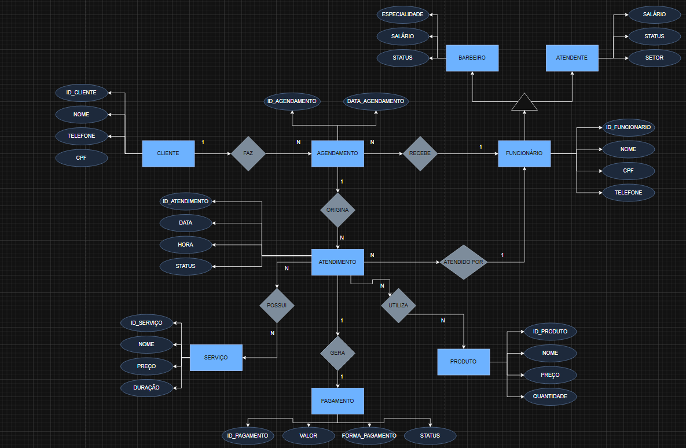

# 💈 Sistema de Gerenciamento para Barbearia

Sistema de gerenciamento de barbearia desenvolvido para controle de:

- Clientes
- Funcionários (Barbeiros e Atendentes)
- Serviços e Produtos
- Agendamentos e Atendimentos
- Pagamentos

O projeto foi modelado utilizando conceitos de Banco de Dados Relacional com DER (Diagrama Entidade-Relacionamento) e implementado inicialmente em Excel como protótipo funcional.

---

# 📌 Objetivo

O sistema tem como objetivo facilitar o gerenciamento de uma barbearia, permitindo:

- Cadastro de clientes
- Cadastro de funcionários (barbeiros e atendentes)
- Controle de serviços e produtos
- Agendamento e controle de atendimentos
- Controle de pagamentos
- Organização financeira

---

# ✅ Requisitos Funcionais

| Código | Descrição |
|--------|-----------|
| RF01 | O sistema deve permitir cadastrar um cliente com nome, telefone e CPF. |
| RF02 | O sistema deve permitir editar e excluir o cadastro de um cliente. |
| RF03 | O sistema deve permitir cadastrar um barbeiro com especialidade, salário e status, herdando dados de Funcionário. |
| RF04 | O sistema deve permitir cadastrar um atendente com salário, status e setor, herdando dados de Funcionário. |
| RF05 | O sistema deve permitir editar e excluir o cadastro de funcionários. |
| RF06 | O sistema deve permitir cadastrar serviços com nome, preço e duração. |
| RF07 | O sistema deve permitir cadastrar produtos com nome, preço e quantidade. |
| RF08 | O sistema deve permitir registrar um agendamento vinculando um cliente e um funcionário, com data. |
| RF09 | O sistema deve registrar atendimentos vinculados a agendamentos, contendo serviços e produtos. |
| RF10 | O sistema deve suportar múltiplos serviços e produtos em um mesmo atendimento (relação N:N). |
| RF11 | O sistema deve gerar automaticamente um pagamento ao concluir um atendimento. |
| RF12 | O sistema deve registrar a forma de pagamento, o valor e o status do pagamento. |
| RF13 | O sistema deve permitir atualizar o status do pagamento para: pendente, pago ou estornado. |
| RF14 | O sistema deve garantir que cada atendimento possua no máximo um pagamento associado (1:1). |

---

# 🗂 Estrutura do Projeto

O banco de dados foi dividido nas seguintes entidades:

## 👤 Cliente

Armazena informações dos clientes da barbearia.

### Atributos

| Campo | Tipo |
|---|---|
| ID_CLIENTE (PK) | Inteiro |
| NOME | Texto |
| TELEFONE | Texto |
| CPF | Texto |

---

## 👔 Funcionário *(Superclasse)*

Entidade genérica que representa todos os funcionários da barbearia. Especializada em **Barbeiro** e **Atendente**.

### Atributos

| Campo | Tipo |
|---|---|
| ID_FUNCIONARIO (PK) | Inteiro |
| NOME | Texto |
| CPF | Texto |
| TELEFONE | Texto |

---

## ✂️ Barbeiro *(especialização de Funcionário)*

Herda os atributos de Funcionário e adiciona informações específicas do barbeiro.

### Atributos próprios

| Campo | Tipo |
|---|---|
| ID_FUNCIONARIO (PK/FK) | Inteiro |
| ESPECIALIDADE | Texto |
| SALÁRIO | Decimal |
| STATUS | Texto |

---

## 🧾 Atendente *(especialização de Funcionário)*

Herda os atributos de Funcionário e adiciona informações específicas do atendente.

### Atributos próprios

| Campo | Tipo |
|---|---|
| ID_FUNCIONARIO (PK/FK) | Inteiro |
| SALÁRIO | Decimal |
| STATUS | Texto |
| SETOR | Texto |

---

## 💇 Serviço

Armazena os serviços oferecidos pela barbearia.

### Atributos

| Campo | Tipo |
|---|---|
| ID_SERVIÇO (PK) | Inteiro |
| NOME | Texto |
| PREÇO | Decimal |
| DURAÇÃO | Inteiro (minutos) |

---

## 📦 Produto

Armazena os produtos comercializados pela barbearia.

### Atributos

| Campo | Tipo |
|---|---|
| ID_PRODUTO (PK) | Inteiro |
| NOME | Texto |
| PREÇO | Decimal |
| QUANTIDADE | Inteiro |

---

## 📅 Agendamento

Responsável pelo controle dos agendamentos dos clientes com os funcionários.

### Atributos

| Campo | Tipo |
|---|---|
| ID_AGENDAMENTO (PK) | Inteiro |
| DATA_AGENDAMENTO | Data |

### Relacionamentos

- Cliente **faz** Agendamento (1:N)
- Agendamento **recebe** Funcionário (N:1)
- Agendamento **origina** Atendimento (1:N)

---

## 🪑 Atendimento

Representa a execução do serviço agendado. Vincula os serviços e produtos consumidos.

### Atributos

| Campo | Tipo |
|---|---|
| ID_ATENDIMENTO (PK) | Inteiro |
| DATA | Data |
| HORA | Hora |
| STATUS | Texto |

### Relacionamentos

- Atendimento **possui** Serviços (N:N)
- Atendimento **utiliza** Produtos (N:N)
- Atendimento é **atendido por** Funcionário (N:1)
- Atendimento **gera** Pagamento (1:1)

---

## 💳 Pagamento

Controla os pagamentos realizados por atendimento.

### Atributos

| Campo | Tipo |
|---|---|
| ID_PAGAMENTO (PK) | Inteiro |
| VALOR | Decimal |
| FORMA_PAGAMENTO | Texto |
| STATUS | Texto |

---

# 🔗 Relacionamentos do Sistema

| Relacionamento | Cardinalidade |
|---|---|
| Cliente → Agendamento | 1:N (Faz) |
| Agendamento → Funcionário | N:1 (Recebe) |
| Agendamento → Atendimento | 1:N (Origina) |
| Atendimento → Serviço | N:N (Possui) |
| Atendimento → Produto | N:N (Utiliza) |
| Atendimento → Funcionário | N:1 (Atendido Por) |
| Atendimento → Pagamento | 1:1 (Gera) |
| Funcionário ← Barbeiro | Especialização |
| Funcionário ← Atendente | Especialização |

---

# 🧩 Modelo Conceitual

O sistema foi modelado utilizando DER (Diagrama Entidade Relacionamento).

## Entidades principais

- Cliente
- Funcionário (Barbeiro / Atendente)
- Serviço
- Produto
- Agendamento
- Atendimento
- Pagamento

---

# 📊 Funcionalidades

✅ Cadastro de clientes  
✅ Cadastro de barbeiros e atendentes  
✅ Cadastro de serviços e produtos  
✅ Controle de agendamentos  
✅ Controle de atendimentos  
✅ Controle de pagamentos  
✅ Controle financeiro básico  
✅ Organização relacional dos dados com herança (Funcionário → Barbeiro / Atendente)  

---

# 🛠 Tecnologias Utilizadas

- Excel
- Modelagem DER
- Banco de Dados Relacional

---

# 📷 DER do Sistema



---

## 📖 Legenda do DER

| Símbolo | Significado |
|---|---|
| Elipse (cinza) | Atributo |
| Retângulo (azul) | Entidade |
| Losango (cinza) | Relacionamento |
| Triângulo | Especialização (herança) |

---

# 📁 Estrutura das Planilhas

O arquivo Excel contém:

```
Clientes
Funcionários
Barbeiros
Atendentes
Serviços
Produtos
Agendamentos
Atendimentos
Pagamentos
```

---

# 📁 Arquivo Excel

[📊 Sistema_Barbearia_Tabelas.xlsx](banco_barbearia.xlsx)


# 📁 Banco de Dados MySql

[💾 Banco de Dados Etapa 2](assets/barbearia_sql.sql)

[💾 Banco de Dados Etapa 3 - Consultas](assets/consultas.sql.sql)
