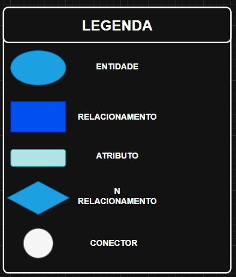

# 💈 Sistema de Gerenciamento para Barbearia

Sistema de gerenciamento de barbearia desenvolvido para controle de:

- Clientes
- Barbeiros
- Serviços
- Agendamentos
- Pagamentos

O projeto foi modelado utilizando conceitos de Banco de Dados Relacional e implementado inicialmente em Excel como protótipo funcional.

---

# 📌 Objetivo

O sistema tem como objetivo facilitar o gerenciamento de uma barbearia, permitindo:

- Cadastro de clientes
- Cadastro de barbeiros
- Controle de serviços
- Agendamento de atendimentos
- Controle de pagamentos
- Organização financeira

---

# ✅ Requisitos Funcionais

| Código | Descrição |
|--------|-----------|
| RF01 | O sistema deve permitir cadastrar um cliente com nome, telefone, email e data de nascimento. |
| RF02 | O sistema deve permitir editar e excluir o cadastro de um cliente. |
| RF03 | O sistema deve permitir cadastrar um barbeiro com nome, especialidade e telefone. |
| RF04 | O sistema deve permitir editar e excluir o cadastro de um barbeiro. |
| RF05 | O sistema deve permitir cadastrar serviços com nome, preço e duração estimada em minutos. |
| RF06 | O sistema deve permitir registrar um agendamento vinculando um cliente, um barbeiro e um serviço. |
| RF07 | O sistema deve registrar a data, hora e status de cada agendamento. |
| RF08 | O sistema deve permitir atualizar o status do agendamento para: agendado, concluído ou cancelado. |
| RF09 | O sistema deve gerar automaticamente um pagamento ao concluir um agendamento. |
| RF10 | O sistema deve registrar a forma de pagamento (dinheiro, cartão ou pix), o valor e a data do pagamento. |
| RF11 | O sistema deve permitir atualizar o status do pagamento para: pendente, pago ou estornado. |
| RF12 | O sistema deve garantir que cada agendamento possua no máximo um pagamento associado. |

---

# 🗂 Estrutura do Projeto

O banco de dados foi dividido nas seguintes entidades:

## 👤 Cliente

Armazena informações dos clientes da barbearia.

### Atributos

| Campo | Tipo |
|---|---|
| id_cliente (PK) | Inteiro |
| nome | Texto |
| telefone | Texto |
| email | Texto |
| data_nascimento | Data |

---

## ✂️ Barbeiro

Armazena informações dos barbeiros.

### Atributos

| Campo | Tipo |
|---|---|
| id_barbeiro (PK) | Inteiro |
| nome | Texto |
| especialidade | Texto |
| telefone | Texto |

---

## 💇 Serviço

Armazena os serviços oferecidos pela barbearia.

### Atributos

| Campo | Tipo |
|---|---|
| id_servico (PK) | Inteiro |
| nome_servico | Texto |
| preco | Decimal |
| duracao_min | Inteiro |

---

## 📅 Agendamento

Responsável pelo controle dos atendimentos.

### Atributos

| Campo | Tipo |
|---|---|
| id_agendamento (PK) | Inteiro |
| data | Data |
| hora | Hora |
| status | Texto |

### Relacionamentos

- Cliente realiza agendamento
- Barbeiro atende agendamento
- Serviço é oferecido no agendamento

---

## 💳 Pagamento

Controla os pagamentos realizados.

### Atributos

| Campo | Tipo |
|---|---|
| id_pagamento (PK) | Inteiro |
| forma_pagamento | Texto |
| valor | Decimal |
| data | Data |
| status_pagamento | Texto |

### Relacionamento

- Agendamento gera pagamento

---

# 🔗 Relacionamentos do Sistema

| Relacionamento | Cardinalidade |
|---|---|
| Cliente → Agendamento | 1:N |
| Barbeiro → Agendamento | 1:N |
| Serviço → Agendamento | 1:N |
| Agendamento → Pagamento | 1:1 |

---

# 🧩 Modelo Conceitual

O sistema foi modelado utilizando DER (Diagrama Entidade Relacionamento).

## Entidades principais

- Cliente
- Barbeiro
- Serviço
- Agendamento
- Pagamento

---

# 📊 Funcionalidades

✅ Cadastro de clientes  
✅ Cadastro de barbeiros  
✅ Cadastro de serviços  
✅ Controle de agendamentos  
✅ Controle de pagamentos  
✅ Controle financeiro básico  
✅ Organização relacional dos dados  

---

# 🛠 Tecnologias Utilizadas

- Excel
- Modelagem DER
- Banco de Dados Relacional

---

# 📷 DER do Sistema


---

## 📖 Legenda do DER



---

# 📁 Estrutura das Planilhas

O arquivo Excel contém:

```bash
Clientes
Barbeiros
Servicos
Agendamentos
Pagamentos
```

---

# 📁 Arquivo Excel

[📊 Sistema_Barbearia_Tabelas.xlsx](Sistema_Barbearia_Tabelas.xlsx)
